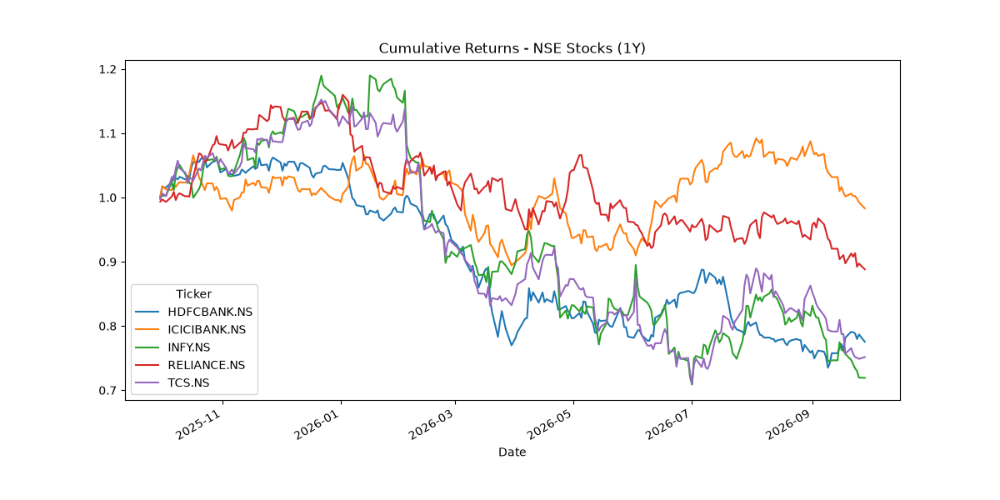

# NSE Quant Analysis

Compares 5 NSE stocks on annualized return, volatility, and Sharpe ratio over the last 1 year.

## What it does
- Downloads 1 year of daily price data for 5 large-cap NSE stocks using yfinance/
- Computes daily returns, annualized return, annualized volatility, and Sharpe ratio
- Plots cumulative returns and saves the chart

## Setup
pip install -r requirements.txt

## Run
python project.py

## Output

- Annualized return, volatility, and Sharpe ratio for each stock
- Cumulative return chart saved as report.png

## results

| Stock | Ann. Return | Ann. Volatility | Sharpe |
| HDFCBANK.NS | -23.7% | 21% | -1.10 |
| ICICIBANK.NS | -0.7% | 19% | -0.04 |
| INFY.NS | -28.7% | 30% | -0.96 |
| RELIANCE.NS | -10.3% | 21% | -0.50 |
| TCS.NS | -25.5% | 28% | -0.90 |

